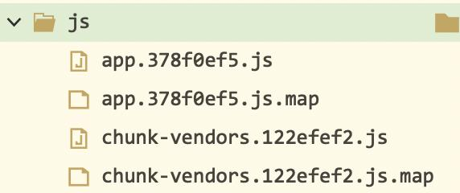
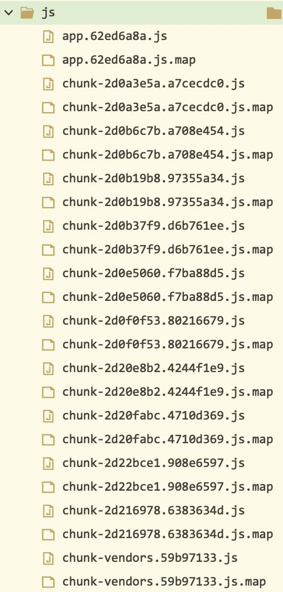

# Commonjs和es6导入导出的区别
> 在写代码时，经常需要写一个类封装。但每当写到最后需要`exports`的时候，都会去看一下其他的类之前是怎么写的。导出时，`export`/`exports.default`/`export default`，之间傻傻分不清楚。引入时，、`import`/`require`，也分不清，总是没时间好好整理。最近终于有时间好好看了一遍，其实整理清楚了并不难，说白了就是两种规范导致的，一种是CommonJS规范，另一种是es6的规范。


### CommonJS(Common2js)
#### 关键字

module exports require

#### 相关链接
[CommonJS规范-阮一峰](https://javascript.ruanyifeng.com/nodejs/module.html)
[CommonJS官网](http://www.commonjs.org/specs/modules/1.0/)

#### 心得
1. 我们用的CommonJS实际上是Common2JS，其区别是：只有Common2JS才有`module.exports`，CommonJS只有`exports`
2. 只用`module.exports`,不要用`exports`,以避免因为`exports = () => {}`,导致`module.exports`对象仍然为空的情况发生

#### 代码
```js
//example.js
var x = 5;
var addX = function (value) {
  return value + x;
};
module.exports.x = x;
module.exports.addX = addX;

// main.js
var b = require('example').x; // 单独调用example.x
var exp = require('example'); // 完整调用example
console.log(example.x); // 5
console.log(example.addX(1)); // 6

```

### vue cli中关于require的用法
vue cli中，引用图片推荐使用require，优点如下：
1. 代码更简单
require即插即用，但是import需要promise，也仅限于在`script`中使用
```js
// 使用require
initMovieClipImageArray() {
	let ret = [];

	for (let i = 1; i <= 10; i++) {
		let srcUtil = require(`../imgs/movieclip/mc_${i}.jpg`);
		ret.push(srcUtil);
	}

	this.movieClipInfo.imageArray = ret;
}

// 使用import
async initMovieClipImageArray() {
	let ret = [];

	for (let i = 1; i <= 10; i++) {
		let { default: srcUtil } = await import(
			`../imgs/movieclip/mc_${i}.jpg`
		);
		ret.push(srcUtil);
	}

	this.movieClipInfo.imageArray = ret;
},
```

2. build生成的文件更简单
使用require，不会产生多余的chunk文件，如下图所示：


使用import，会产生很多chunk文件。如上方代码，i循环了10次，就会产生10*2个chunk文件，如下图所示：
