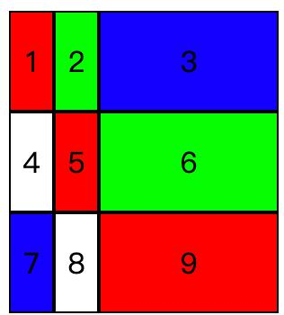
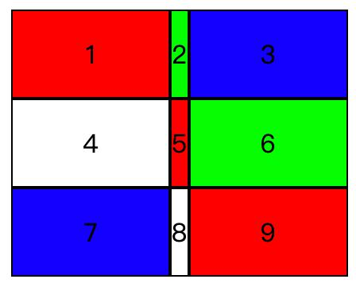

# grid布局笔记

### minmax
minmax()函数产生一个长度范围，表示长度就在这个范围之中。它接受两个参数，分别为最小值和最大值。
如果最小值大于最大值，minmax仍旧使用最小值：比如下面代码中，1fr的实际值会比100px小，这时第三列宽度最终为100px，三列的宽度依次是25，25，100。
```css
.grid{
  display:grid;
  width: 150px;
  height: 150px;
  grid-template-columns: 1fr 1fr minmax(100px,1fr);
  grid-template-rows: repeat(3, 1fr);
}
```
```html
<div class="grid">
   <div><p>1</p></div>
   <div><p>2</p></div>
   <div><p>3</p></div>
   <div><p>4</p></div>
   <div><p>5</p></div>
   <div><p>6</p></div>
   <div><p>7</p></div>
   <div><p>8</p></div>
   <div><p>9</p></div>
</div>
```

### auto
auto关键字表示由浏览器自己决定长度。
auto宽度最小时，等于其内部内容的宽度：比如下面代码中，中间列的宽度不是-50，而是9.6，即第二列里字符的宽度
```css
.grid{
  display:grid;
  width: 150px;
  height: 150px;
  grid-template-columns: 100px auto 100px;
  grid-template-rows: repeat(3, 1fr);
}
```
```html
<div class="grid">
   <div><p>1</p></div>
   <div><p>2</p></div>
   <div><p>3</p></div>
   <div><p>4</p></div>
   <div><p>5</p></div>
   <div><p>6</p></div>
   <div><p>7</p></div>
   <div><p>8</p></div>
   <div><p>9</p></div>
</div>
```
